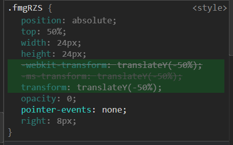
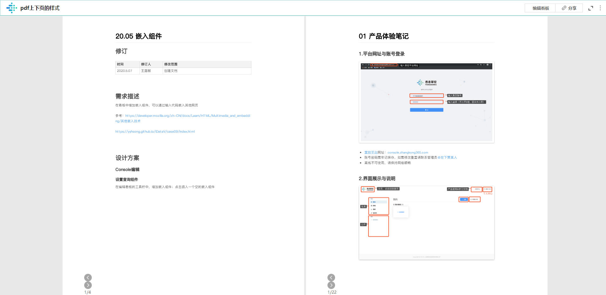
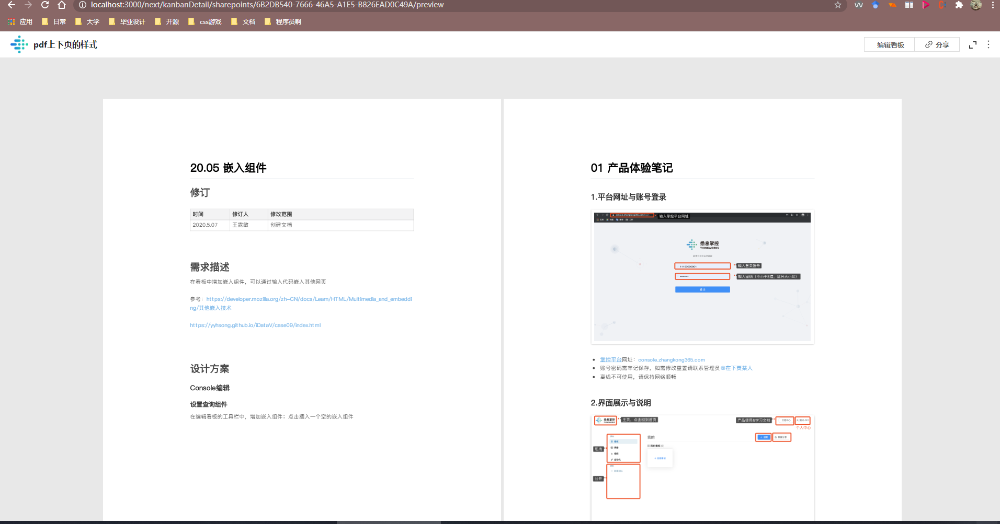
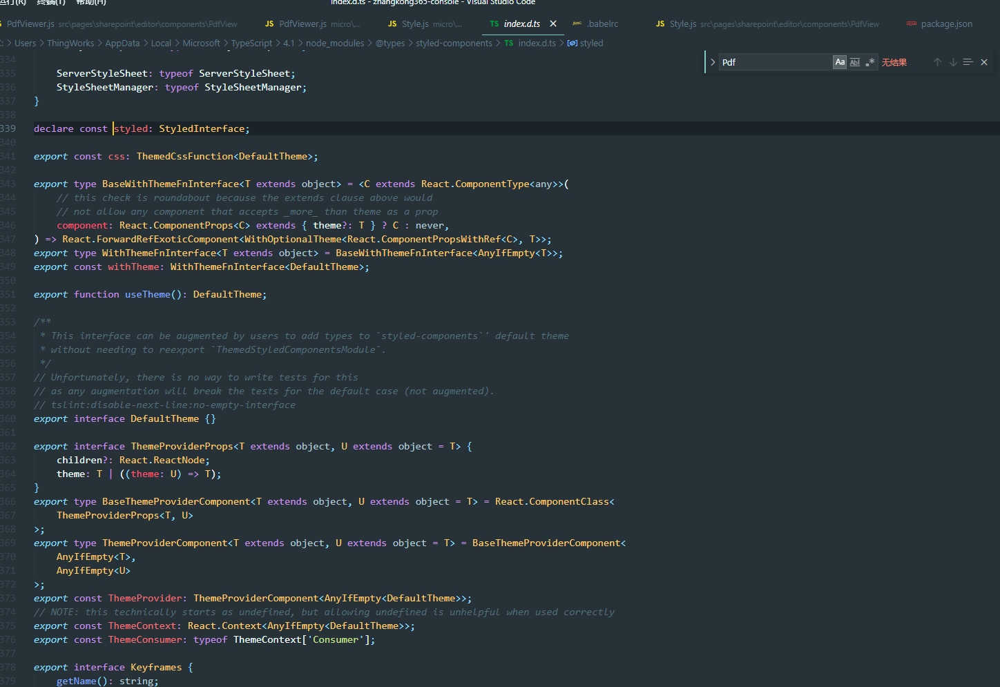

**上下页button样式**

样式文件使用了style-components即css in js

分别在\micro\src\pages\sharepoint\editor\components\PdfView

和\src\pages\sharepoint\editor\components\PdfView

```js
import styled from 'styled-components';

const PdfViewWrapper = styled.div`
  position: ${props => (props.isFullScreen ? 'static' : 'relative')};
  margin: ${props => (props.isFullScreen ? '32px' : 0)};
`;

const PageButtonCommon = styled.div`
  position: absolute;
  top: 50%;
  width: 24px;
  height: 24px;
  transform: translateY(-50%);
  opacity: ${props => (props.showButton ? 1 : 0)};
  pointer-events: ${props => (props.showButton ? 'auto' : 'none')};
  ${PdfViewWrapper}:hover & {
    opacity: ${props => (props.disabled ? 0.1 : 1)};
    pointer-events: auto;
  }
`;

const PrevButtonWrapper = styled(PageButtonCommon)`
  left: ${props => (props.isFullScreen ? '30px' : '8px')};
`;

const NextButtonWrapper = styled(PageButtonCommon)`
  right: ${props => (props.isFullScreen ? '30px' : '8px')};
`;

const PageIndicatorWrapper = styled.div`
  position: absolute;
  bottom: 5px;
  left: 0;
  width: 100%;
  line-height: 18px;
  text-align: center;
  font-size: 10px;
  color: #999;
  opacity: 0;
  pointer-events: none;
  transition: opacity 0.3 ease-out;
  ${PdfViewWrapper}:hover & {
    opacity: 1;
    pointer-events: auto;
  }
`;
export {
  PdfViewWrapper,
  PrevButtonWrapper,
  NextButtonWrapper,
  PageIndicatorWrapper
};
```

其中

```js
const PageButtonCommon = styled.div`
  position: absolute;
  top: 50%;
  width: 24px;
  height: 24px;
  transform: translateY(-50%);
  opacity: ${props => (props.showButton ? 1 : 0)};
  pointer-events: ${props => (props.showButton ? 'auto' : 'none')};
  ${PdfViewWrapper}:hover & {
    opacity: ${props => (props.disabled ? 0.1 : 1)};
    pointer-events: auto;
  }
`;
```

用于定义切换页数的button样式

在实际环境中className为`fmgRZS`



对比test和本地(localhost环境的pdf上下页样式)：

##### test



本地



## 分别检查发现test环境的页面按钮样式丢失！(用上面的已知className查找)

#### 猜测？

**style.js在生产环境通过webpack没有被打包？**

找styled的源码，位置是C:\Users\ThingWorks\AppData\Local\Microsoft\TypeScript\4.1\node_modules\@types\styled-components(似乎跟这个没关系)



那我打包一边试试，打包时有以下的思考方向

### 可能解决方案(不是很确定)：

- 在部署micro的根文件package.json文件中添加styled-components依赖，(yarn add styled-components?)
- 添加beblelrec的插件列表：

以上方案均无法实际操作，哈哈好吧


期间：package.json内build直接执行的是linux命令

调研

##### window yarn run build(windows平台不显示sourcemap进行构建的命令)

`set \"GENERATE_SOURCEMAP=false\" && react-app-rewired --max-old-space-size=10240 build     `

## 之后又调研

[styled-components](https://github.com/styled-components/styled-components)

[相关的问题](https://stackoom.com/question/3cQH0/%E4%BB%8E%E7%94%9F%E4%BA%A7%E7%89%88%E6%9C%AC%E4%B8%AD%E5%89%A5%E7%A6%BB%E5%87%BA%E6%9D%A5%E7%9A%84React%E6%A0%B7%E5%BC%8F%E7%BB%84%E4%BB%B6)

请查看此链接

https://styled-components.com/releases#v4.1.0

其中官方文档有对这个样式丢失的处理办法，可是我没法实现，就是

#### **创建一个名为`globals.js`的新文件，其中包含`global.SC_DISABLE_SPEEDY = true`并将其作为`index.js`第一件事导入。**

具体怎么实现还得再看看