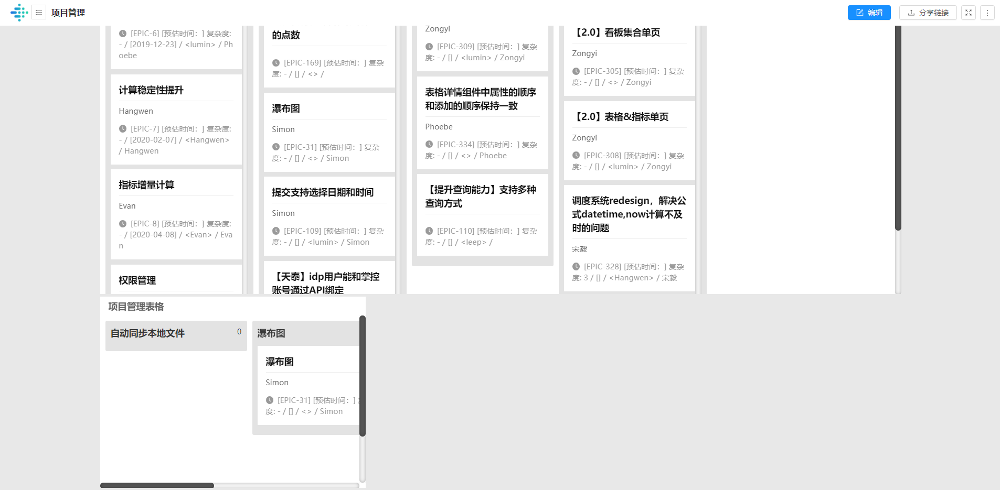
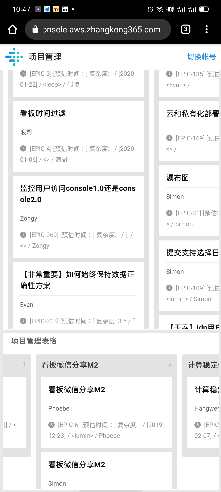
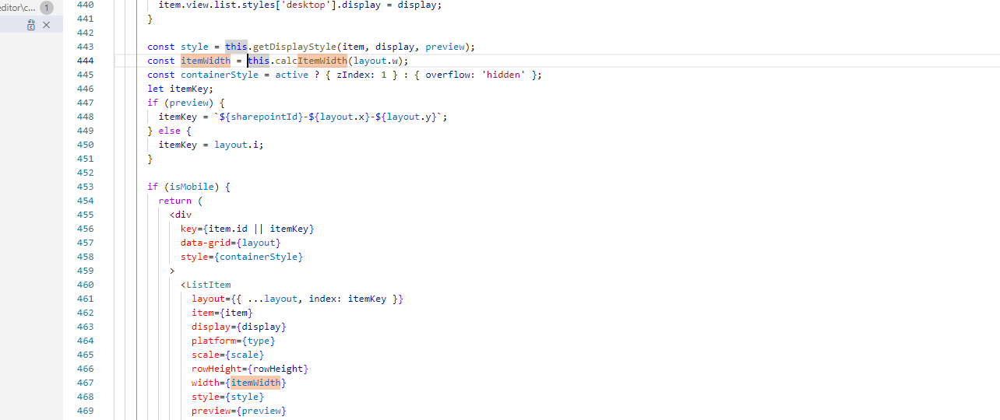
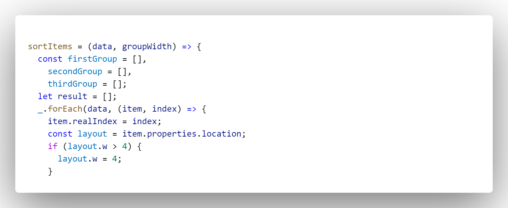

手机端



手机端更改后，itemWidth发生变化

```js
//const itemWidth = this.calcItemWidth(layout.w);
calcItemWidth = w => {
    const margin = GridItemMargin;
    const itemWidth = Math.round(
      this.colWidth * w + Math.max(0, w - 1) * margin
    );
    return itemWidth;
  };
```

而pc端的itemWidth同样使用的是这个ItemWidth




# 解决方案：

src\pages\sharepoint\editor\components\layout\GridLayout.js 

369行



这里把layout.w设为了4

?

把if注释掉

<b>OK？😁</b>
