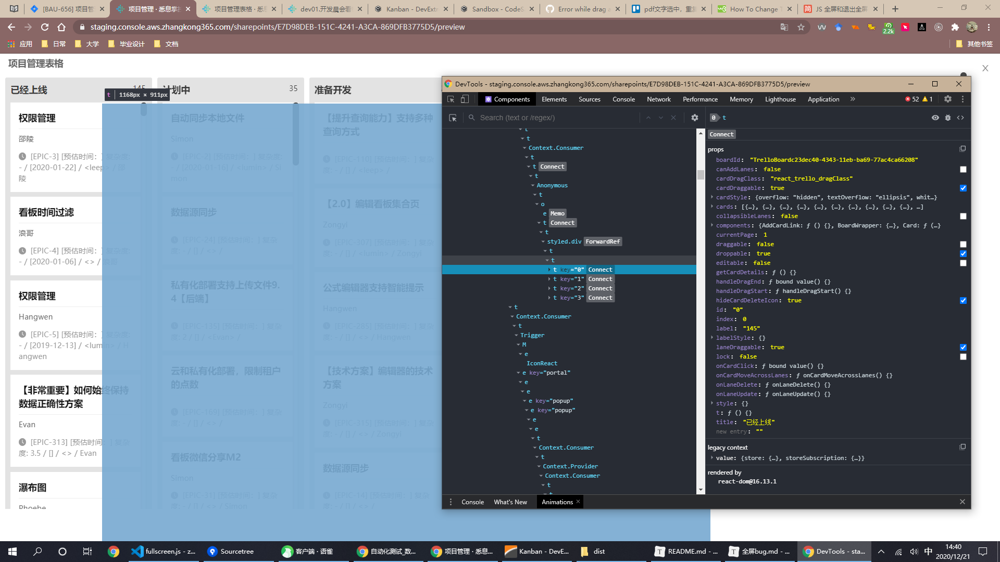

全屏bug

http://jira.thingworks.cn:8080/browse/BAU-656?workflowName=Software+Simplified+Workflow+for+Project+ZK&stepId=1

似乎：

***.进入全屏的元素，将脱离其父元素***

# isFullScreen:true时

**会有两个trelloComponent组件**

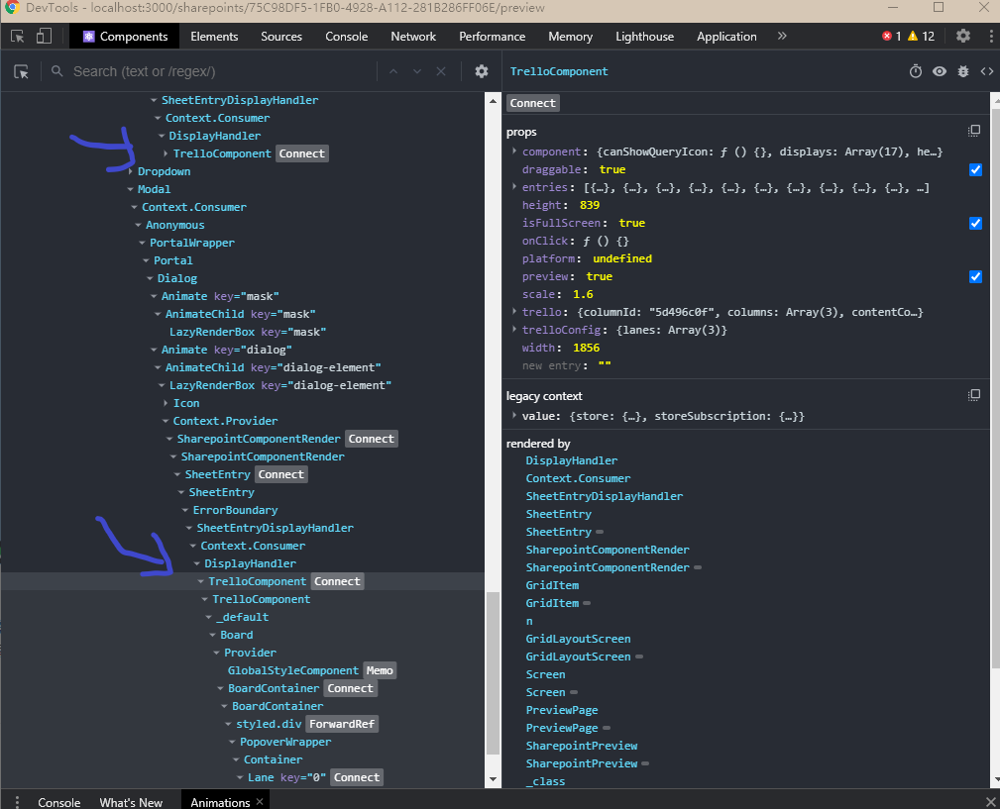


第一个board

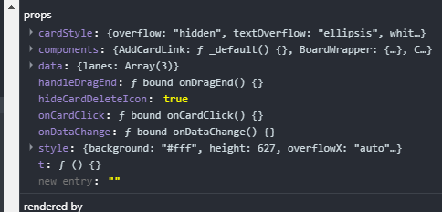

第二个board

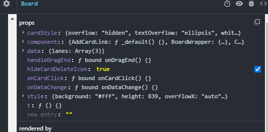

第一个trelloComponent

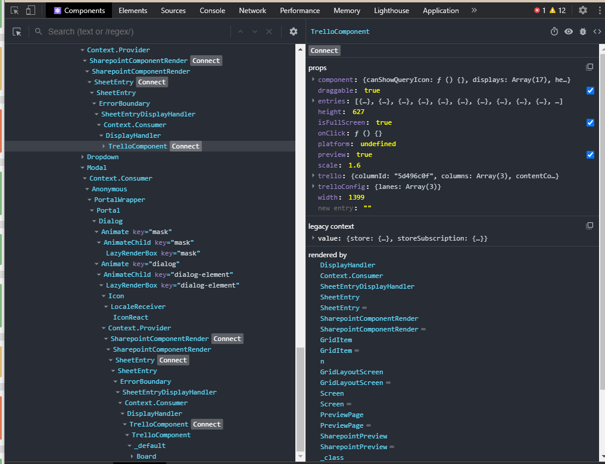

第二个trelloComponent

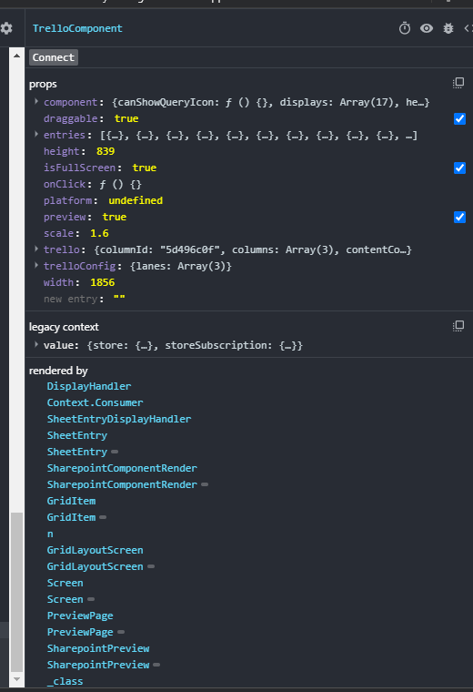

想法是：

在isfullscreen:true时只渲染全屏的board,不渲染第一个board或者trelloComponent

然而这样不行，两个相同组件都是同时渲染的，无法区分

之后简单通过width区分把第一个去掉

可以去隐藏，但是结果没变**，BUG依然还在**


继续深入组件

全屏

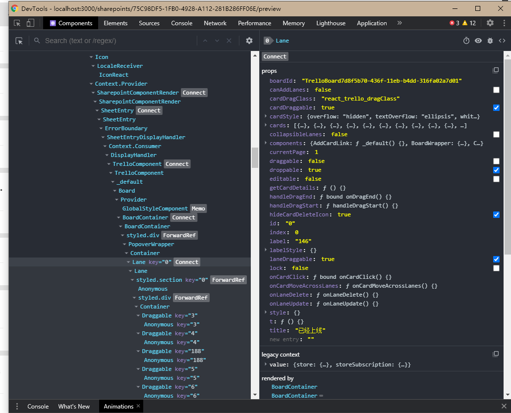

未全屏

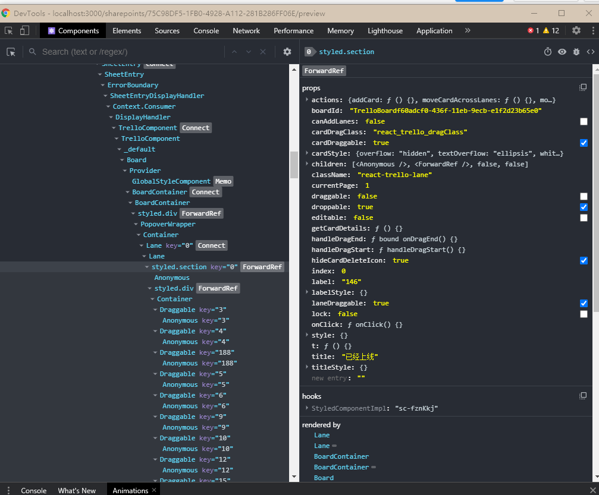

不行不行

先理一下思路

draggable上下拖动的时候，其他的draggables不让开

两个

board

```json
{
 c "t": "ƒ () {}",
  "components": {
    "GlobalStyle": "{$$typeof: Symbol(react.memo), compare: null, type:…}",
    "BoardWrapper": "{$$typeof: Symbol(react.forward_ref), attrs: Array(…}",
    "Loader": "ƒ Loader() {}",
    "ScrollableLane": "{$$typeof: Symbol(react.forward_ref), attrs: Array(…}",
    "LaneHeader": "ƒ () {}",
    "LaneFooter": "ƒ _default() {}",
    "Section": "{$$typeof: Symbol(react.forward_ref), attrs: Array(…}",
    "NewLaneForm": "ƒ NewLane() {}",
    "NewLaneSection": "ƒ _default() {}",
    "NewCardForm": "ƒ NewCardForm() {}",
    "Card": "ƒ () {}",
    "AddCardLink": "ƒ _default() {}"
  },
  "data": {
    "lanes": "[{…}, {…}, {…}]"
  },
  "onDataChange": "ƒ bound onDataChange() {}",
  "handleDragEnd": "ƒ bound onDragEnd() {}",
  "onCardClick": "ƒ bound onCardClick() {}",
  "hideCardDeleteIcon": true,
  "style": {
    "width": 1856,
    "height": 839,
    "background": "#fff",
    "overflowX": "auto",
    "overflowY": "auto"
  },
  "cardStyle": {
    "whiteSpace": "nowrap",
    "overflow": "hidden",
    "textOverflow": "ellipsis"
  }
}
```


```json


{
  "t": "ƒ () {}",
  "components": {
    "GlobalStyle": "{$$typeof: Symbol(react.memo), compare: null, type:…}",
    "BoardWrapper": "{$$typeof: Symbol(react.forward_ref), attrs: Array(…}",
    "Loader": "ƒ Loader() {}",
    "ScrollableLane": "{$$typeof: Symbol(react.forward_ref), attrs: Array(…}",
    "LaneHeader": "ƒ () {}",
    "LaneFooter": "ƒ _default() {}",
    "Section": "{$$typeof: Symbol(react.forward_ref), attrs: Array(…}",
    "NewLaneForm": "ƒ NewLane() {}",
    "NewLaneSection": "ƒ _default() {}",
    "NewCardForm": "ƒ NewCardForm() {}",
    "Card": "ƒ () {}",
    "AddCardLink": "ƒ _default() {}"
  },
  "data": {
    "lanes": "[{…}, {…}, {…}]"
  },
  "onDataChange": "ƒ bound onDataChange() {}",
  "handleDragEnd": "ƒ bound onDragEnd() {}",
  "onCardClick": "ƒ bound onCardClick() {}",
  "hideCardDeleteIcon": true,
  "style": {
    "width": 1399,
    "height": 627,
    "background": "#fff",
    "overflowX": "auto",
    "overflowY": "auto"
  },
  "cardStyle": {
    "whiteSpace": "nowrap",
    "overflow": "hidden",
    "textOverflow": "ellipsis"
  }
}
```

不行不行，这算是复制组件，这样应该也看不出什么东西出来

先理一下思路

问题现在描述为 	

### draggable上下拖动的时候，其他的draggables不让开

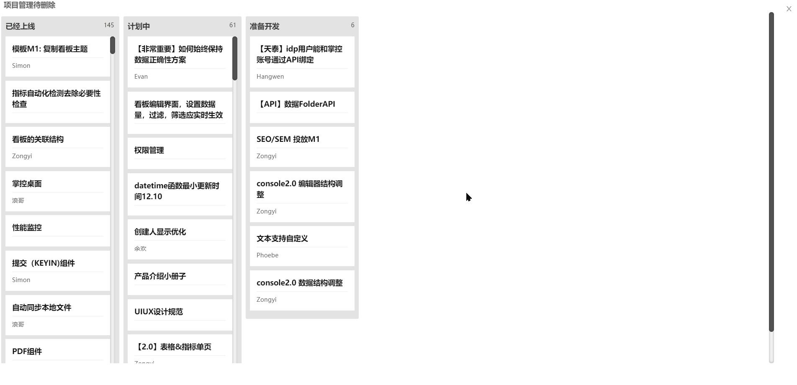

fullscreen的render代码

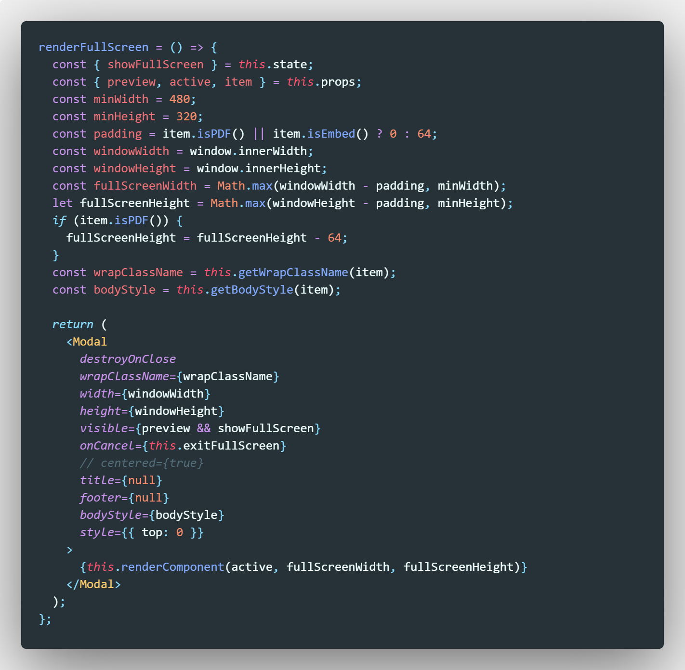

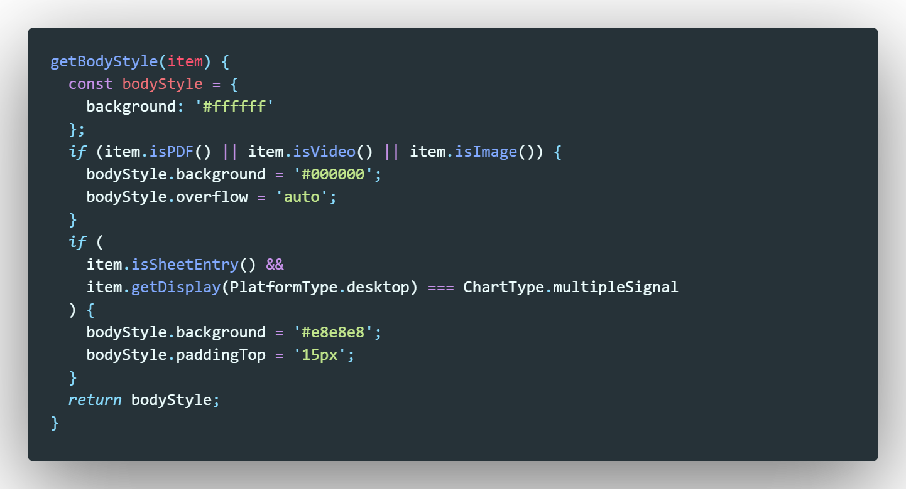

可以看出项目管理全屏组件的style是脱皮了的

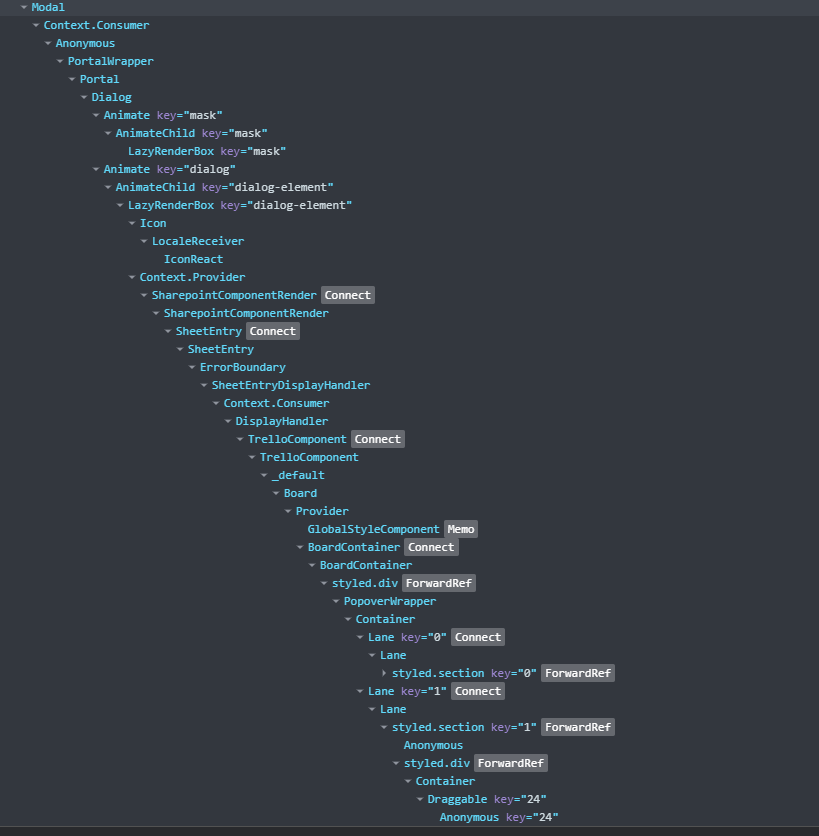

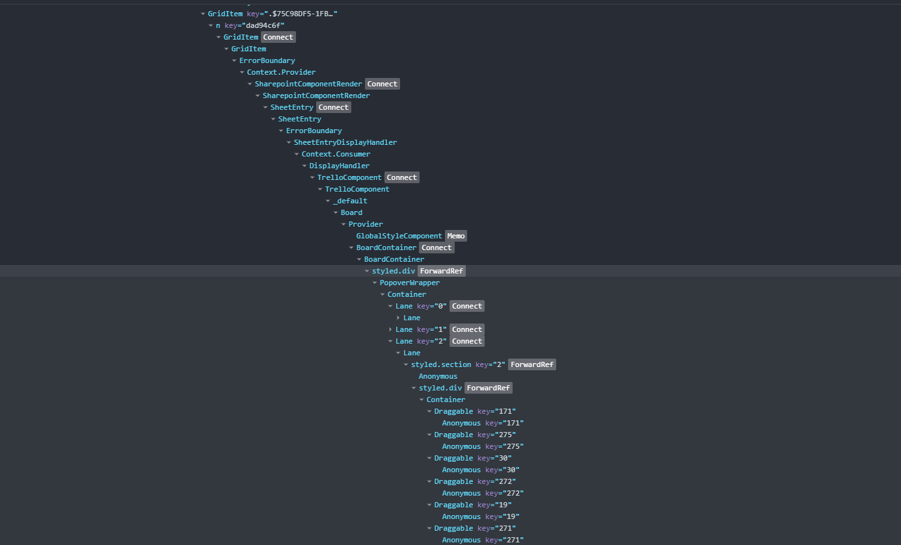