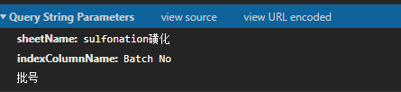

# 1.表格导入数据索引列包含回车符

*.replace(/[\r]/g,"")*去掉回车%0d

*.replace(/[ ]/g,"")*去掉空格%20

.replace(/[ ]|[\r]/g,"") 去掉空格和换行

正确的indexColumnName为%20保留，%0a换行保留

之前使用.trim（）

## **应该要去除回车**

# 2.错误信息不一致

之前

错误的message本应该为

所以改了一下错误信息