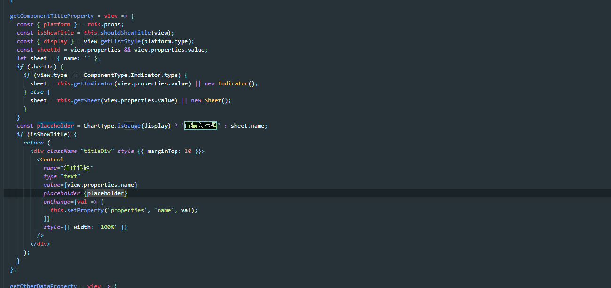
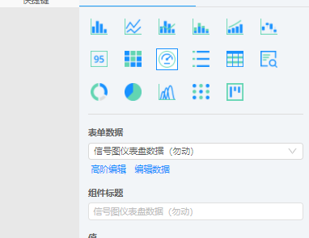
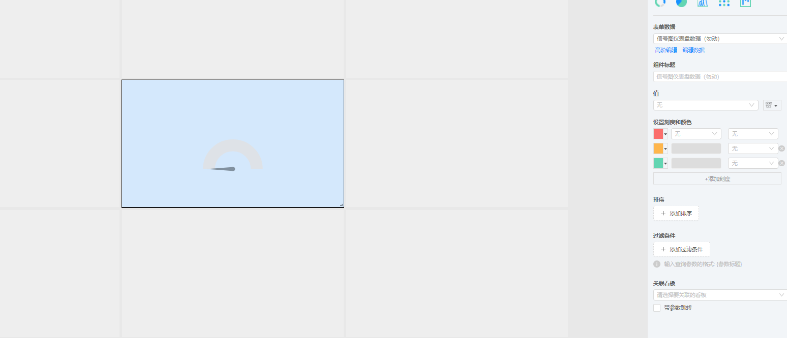
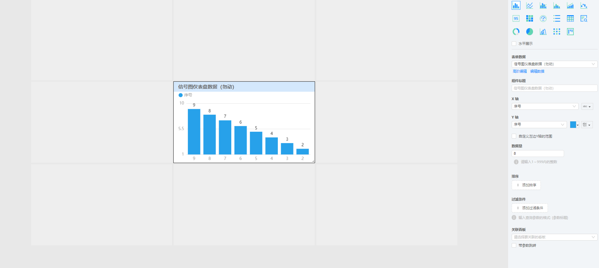

该文件src\pages\sharepoint\editor\components\ComponentEditor.js下

912行：getComponentTitleProperty函数

规定如果选择表格展示为gauge(仪表盘)，Control组件的placeholder就设置为"请输入组件标题"



**把其中定义placeholder一行改为**

```js
  // const placeholder = ChartType.isGauge(display) ? '请输入标题' : sheet.name;
    const placeholder = sheet.name;
```

新建表格，展示为仪表盘，选择表单数据会自动生成



但奇怪的是组件标题并没有在组件上显示



​	{
  "placeholder": "信号图仪表盘数据（勿动）",
  "onChange": "ƒ onChange() {}",
  "style": {
​    "width": "100%"
  }
}

但如果是其他组件，比如信号图



{
  "placeholder": "信号图仪表盘数据（勿动）",
  "onChange": "ƒ onChange() {}",
  "style": {
    "width": "100%"
  }
}

同样value都是undefined