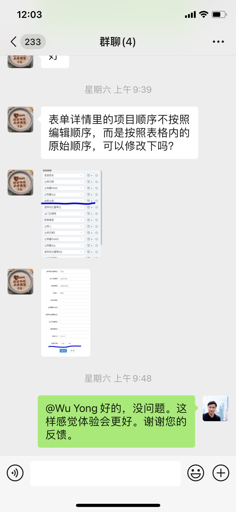
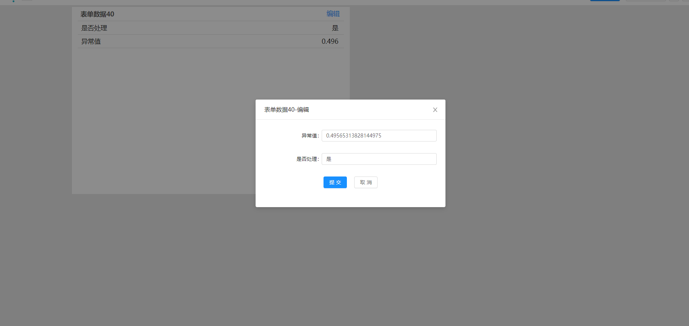
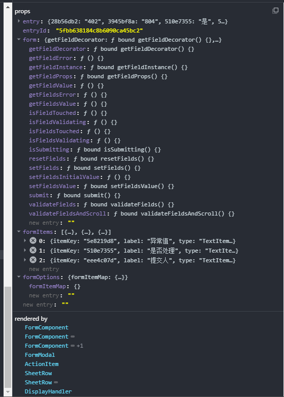
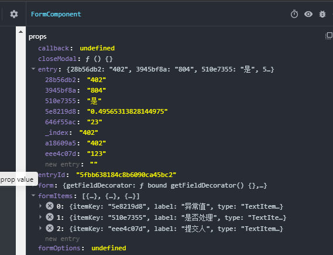
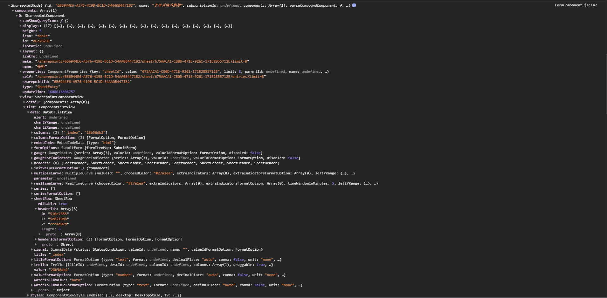
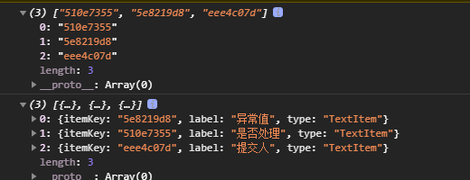

尝试1 *//根据对象entry的Key顺序重排formItems*



主要是对FormComponent组件的formiTems做顺序处理



```js
entry={"_index":"402","28b56db2":"402","a18609a5":"402","eee4c07d":"123","5e8219d8":"0.49565313828144975","510e7355":"是","646f55ac":"23","3945bf8a":"804"}

{"_index":"402","28b56db2":"402","a18609a5":"402","eee4c07d":"123","5e8219d8":"0.49565313828144975","510e7355":"是","646f55ac":"23","3945bf8a":"804"}
```

```js
formItems=[{"itemKey":"5e8219d8","label":"异常值","type":"TextItem"},{"itemKey":"510e7355","label":"是否处理","type":"TextItem"},{"itemKey":"eee4c07d","label":"提交人","type":"TextItem"}]
```



components[0].view.list.data.sheetRow.headerIds




